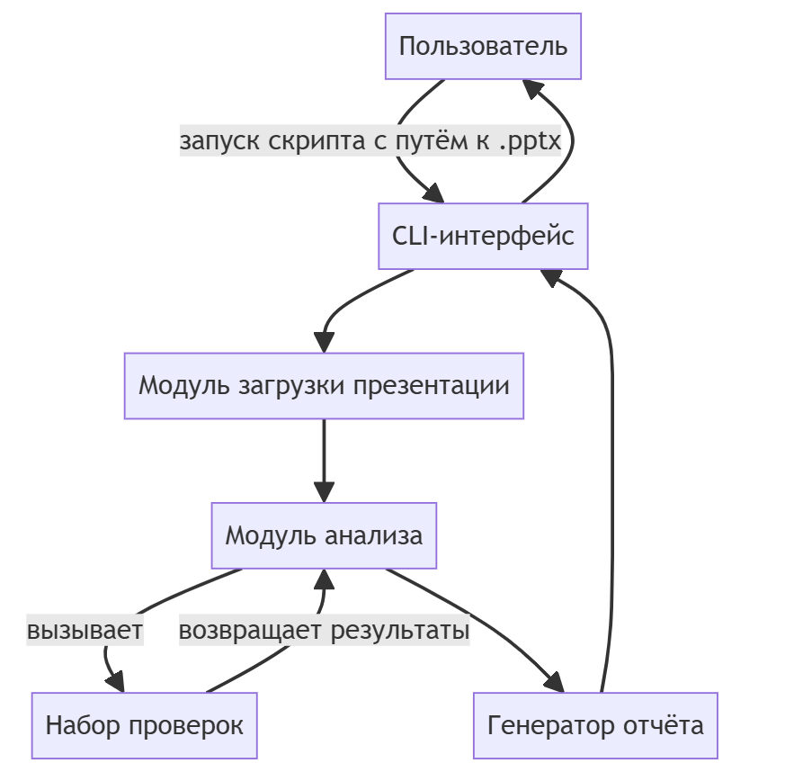
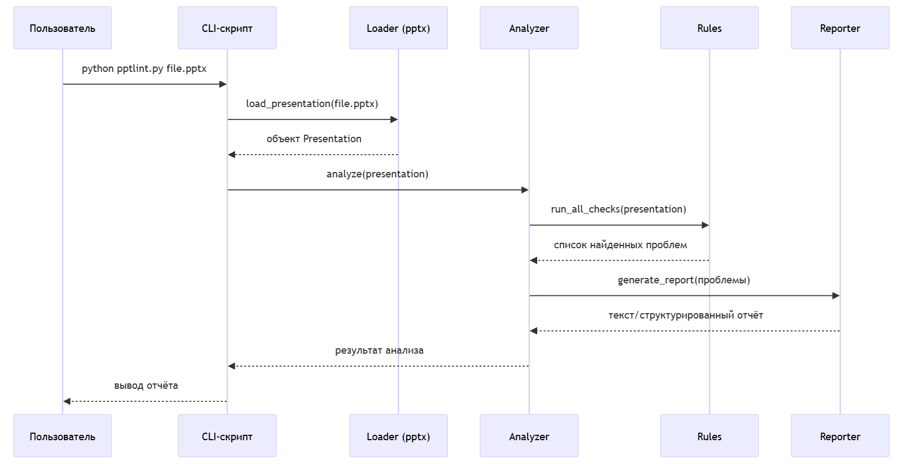
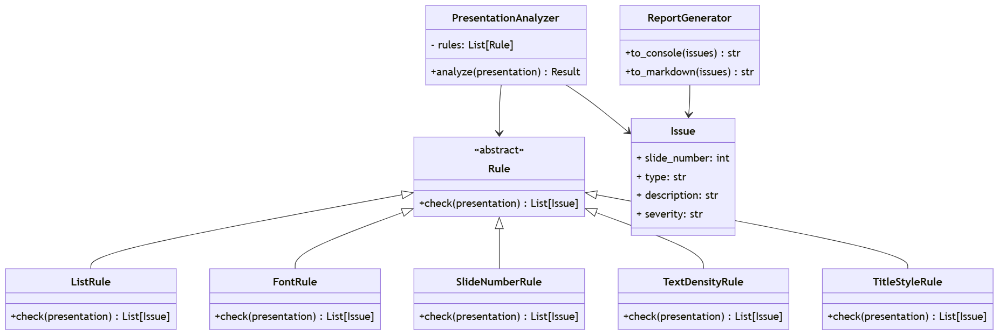

# Final project: PowerPoint Lint

## 1. Общая идея проекта

**PowerPoint Lint** — это простой скрипт на Python, который автоматически проверяет `.pptx`‑презентации на типичные ошибки оформления, из‑за которых преподаватели снижают баллы:

- списки из одного пункта;
- разный шрифт на одном слайде или в одной презентации;
- отсутствие/разрыв нумерации слайдов;
- слишком много текста на слайде;
- разные стили заголовков;
- и другие часто встречающиеся проблемы.

Цель проекта — помочь студентам быстро находить и исправлять типовые ошибки, чтобы перед сдачей привести презентацию к единым стандартам.

---

## 2. Что будет видеть пользователь

### Консольный интерфейс (MVP)

Пользователь запускает скрипт в терминале:

```bash
python pptlint.py path/to/presentation.pptx
```

После выполнения скрипт показывает отчёт:


Файл: path/to/presentation.pptx

[Слайды и списки]
- Слайд 3: список из 1 пункта.
- Слайд 5: на слайде два списка, один из них из 1 пункта.

[Шрифты]
- Слайд 2: разные шрифты в тексте (Calibri, Times New Roman).
- Слайд 7: заголовок не совпадает по шрифту с остальными заголовками.

[Нумерация слайдов]
- Слайд 1: нет номера слайда.

[Перегруженность текстом]
- Слайд 4: более 8 строк текста в одном текстовом блоке.
- Cлайд 8: слишком маленький размер шрифта (12 pt).

Опционально (позже) можно добавить флаг:

```bash
python pptlint.py presentation.pptx --report report.md
```
чтобы сохранить отчёт в файл Markdown.

---

## 3. Какие ошибки будет искать скрипт

MVP‑набор проверок:

1. Списки:
   - Список из одного пункта (`bullet list` или `numbered list`).
   - Список, где у одних пунктов маркеры, а у других — нет.

2. Шрифты:
   - Разные шрифты в пределах одного слайда.
   - Разные шрифты заголовков между слайдами.
   - Слишком много разных шрифтов во всей презентации (например, >3).

3. Нумерация слайдов:
   - Отсутствует номер на части слайдов.
   - Нумерация начинается не с 1.
   - Разрыв нумерации (например, 1, 2, 4, 5…).

4. Перегруженность текстом:
   - Слишком много строк текста на одном слайде (порог, например, >7–8 строк).
   - Очень мелкий шрифт (например, размер < 16 pt).

5. Стиль заголовков:
   - Слайды без заголовка (если это не титульный слайд).
   - Разные уровни заголовков (разные размеры, жирность) между слайдами.

В дальнейшем можно добавить:

- Проверку контраста текста и фона (по цветам).
- Проверку выравнивания элементов.
- Проверку использования шаблона/темы.

---

## 4. Архитектура и взаимодействие модулей

### 4.1. Общая схема работы системы



### 4.2. Последовательность действий



### 4.3. Структура основных классов (проектно)



## 5. План работ и оценка времени

Ниже — ориентировочный план на команду из 2 человек. Время указано в часах чистой работы.

### 5.1. Этапы проекта

| Этап                                      | Подзадача                                      | Оценка, ч |
|-------------------------------------------|------------------------------------------------|-----------|
| 1. Анализ и проектирование                | Сбор требований, список правил                | 3         |
|                                           | Проработка архитектуры, схемы (UML/Mermaid)   | 4         |
|                                           | Подготовка документации в Markdown            | 3         |
| 2. Инфраструктура проекта                 | Создание репозиториев (GitLab/GitHub)         | 1         |
|                                           | Настройка структуры проекта (директории, venv)| 2         |
|                                           | Настройка CI                     | 3         |
| 3. Реализация ядра                        | Модуль загрузки презентации (`Loader`)        | 3         |
|                                           | Каркас PresentationAnalyzer и Rule        | 4         |
| 4. Реализация проверок (MVP)              | Правило списков (`ListRule`)                  | 3         |
|                                           | Правило шрифтов (`FontRule`)                  | 4         |
|                                           | Правило нумерации слайдов (`SlideNumberRule`) | 2         |
|                                           | Правило плотности текста (`TextDensityRule`)  | 3         |
|                                           | Правило стиля заголовков (`TitleStyleRule`)   | 2         |
| 5. Генерация отчёта                       | Текстовый отчёт в консоль                     | 3         |
|                                           | Markdown-отчёт (опционально)                  | 3         |
| 6. Тестирование и отладка                 | Модульные тесты для правил                    | 6         |
|                                           | Тестирование на реальных презентациях         | 4         |
| 7. Документация и подготовка к защите     | Обновление README, примеры запуска            | 3         |
|                                           | Подготовка презентации о проекте              | 4         |

Итого по проекту (оценочно): ~60–63 часов на команду.

---

### 5.2 Распределение ролей в команде

- Егор (Team Lead / Архитектор + Backend)
  - отвечает за архитектуру проекта и структуру кода;
  - ведёт основной репозиторий GitLab, настраивает CI;
  - отвечает за модуль ReportGenerator (отчёт в консоль/Markdown);
  - реализует базовый класс Rule, правила FontRule и TitleStyleRule;
  - участвует в написании документации.

- Лиза (Backend + Документация)
  - реализует PresentationAnalyzer, функцию load_presentation;
  - реализует правила:
    - ListRule — списки из одного пункта;
    - SlideNumberRule — нумерация слайдов;
    - TextDensityRule — плотность текста;
  - пишет модульные тесты к этим правилам;
  - помогает с тестированием на реальных файлах.
  - оформляет README, примеры использования;

Роли могут частично пересекаться: например, каждый участник пишет тесты к своим модулям и делает код-ревью друг другу через Merge Requests на GitLab.

---
